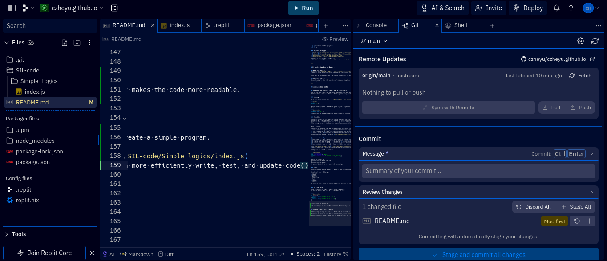

# Node.js Sil
---


## Goals for Student Initiated Learning (2024)


### Items to be achieved:

- [x] Learn the *basics* of Node.js
- [ ] Learn the *background and origin* of Node.js
- [ ] Learn the *pros and cons* of Node.js
- [ ] learn *intermediate concepts* of Node.js
- [ ] Create a simple *project*
- [ ] tbd

      
### Helpful resources
overall just helpful:
- [node.js](https://nodejs.org/en/learn/getting-started/introduction-to-nodejs)
- [mdndocs](https://developer.mozilla.org/en-US/docs/Web/JavaScript)
- [w3schools](https://www.w3schools.com/jsref/)
- [geeksforgeeks](https://www.geeksforgeeks.org/)

helpful in editing this readme.md:
- [markdownguide](https://www.markdownguide.org/extended-syntax/)


### Project Links
- [Simple Math Game](SIL-code/Simple_Logics/index.js)


---


# My understanding of Node.js


## What is node.js
According to [Wikipedia](https://en.wikipedia.org/wiki/Node.js)
- Node.js is a cross-platform, open-source JavaScript runtime environment that can run on Windows, Linux, Unix, macOS, and more. Node.js runs on the V8 JavaScript engine, and executes JavaScript code outside a web browser. Node.js lets developers use JavaScript to write command line tools and for server-side scripting.

From what I understand from reading up, Javascript is mostly used in making interactive and dynamic websites. While node.js is a console focused, back-end runtime that lets you run server-side JavaScript outside of a web browser. I think that it is important to differenciate node.js from pure js, as they ["serve different purposes in the web development ecosystem."](https://reintech.io/blog/difference-between-nodejs-and-javascript) 


## Why use node.js
According to [miquido](https://www.miquido.com/blog/why-use-node-js/), node.js is not only scalable, fast, efficient, cross-platform adaptable, high performance and easy to learn. The node.js community is also huge, allowing for many innovative creations, tutorials, blogs, and creative codebases.
Learning node.js can also carry over into many different frameworks and applications. 

---


# Learning the basics


## Logging, Variables, Types, and If Else Logic

One of the most important building blocks of code and programs are *Logging, Variables, Types, and If Else Logic* 
While writing code with these in them may seem easy, i think mastering the use of them efficiently may need some practice.


### Logging

As i have prior experience in [Python](https://www.python.org/), this instantly makes me think of:

```python
print("hi")
```

While javascript(the language of node.js) is a different language, the syntax is similar, unlike lower level languages like C++.
In js(javascript), outputing a value to the console is as simple as calling the `"console.log()"` method:

```javascript
console.log("hi");
```
> important to put the semicolon as it signifies the end of a line for the interpreter


### Variables

Variables is one of the most well-known concepts related to programming, and so did not need a introduction to this.
Variables are even in math, physics and in block coding apps. 
Accessing and changing a variable in js is almost identical to python's syntax but initializing one is something i have to keep in mind.
After doing research and browsing several web pages, i have come to understand what different initializing keywords achieve and what situations are best fitted for them.


What i learnt:

There are 3 keywords used in initializing a variable, `var`, `let`, and `const`.
- `var` creates a *global*, or functional sometimes (important) variable.
- `let` creates a variable that can be changed and accessed in the scope it was initialized in.
- `const` creats a *constant* variable(as suggested by its name) that cannot be changed, only accessed.

A (very)helpful table i found on [www.geeksforgeeks.org](https://www.geeksforgeeks.org/difference-between-var-let-and-const-keywords-in-javascript/) below:

| var      | let | const     |
| :---        |    :----:   |          ---: |
| The scope of a var variable is functional or global scope.|	The scope of a let variable is block scope.|	The scope of a const variable is block scope.   |
|It can be updated and re-declared in the same scope.|	It can be updated but cannot be re-declared in the same scope.|	It can neither be updated or re-declared in any scope.|
|It can be declared without initialization.|	It can be declared without initialization.|	It cannot be declared without initialization.|
|It can be accessed without initialization as its default value is “undefined”.|	It cannot be accessed without initialization otherwise it will give ‘referenceError’.|	It cannot be accessed without initialization, as it cannot be declared without initialization.|
|These variables are hoisted.|	These variables are hoisted but stay in the temporal dead zone until the initialization.|	These variables are hoisted but stays in the temporal dead zone until the initialization.|

from [www.geeksforgeeks.org](https://www.geeksforgeeks.org/difference-between-var-let-and-const-keywords-in-javascript/) too:
> Note: Sometimes, users face problems while working with the var variable as they change its value of it in a particular block. So, users should use the let and const keywords to declare a variable in JavaScript. 

Using this in a real js example:

```javascript
let variableone;
var variabletwo = "two";
const variablethree = ["one","two","three"]; 
```

where the format is 
keyword variablename = value;
or
keyword variablename;
if we decide just to initiate, but not assign.


### Types

A quick google search results in this as the top response:

JavaScript has 8 Datatypes
- String
- Number
- Bigint
- Boolean
- Undefined
- Null
- Symbol
- Object

As some of these seem new and weird i have decided to only focus on 3 for now, String, Number and Boolean.


### If Else Logic

A core element of code is conditional statements. 
In js the syntax for a if else statement is this:


```javascript
if (true){
  console.log("condition is true")
} else {
  console.log("condition is false")
}
```

^Quite easy to understand.

> I actually like this curlybracket and bracket style as it makes the code more readable.


## Simple conditional program


### Math Game
After going through the basics i feel like i am ready to create a simple program.

I created a index.js file in SIL-code/Simple_logics [here](https://github.com/czheyu/czheyu.github.io/blob/main/SIL-code/Simple_Logics/index.js)
I also connected this github repo to a Replit repl so i can more efficiently write, test, and update code


After installing a input node.js module, ´npm install prompt-sync´ I got this code from the internet.

```javascript
const prompt = require('prompt-sync')();

const name = prompt('What is your name?');
console.log(`Hey there ${name}`);
```
Simple code but we can build and change it into a interesting math game.

```javascript
const prompt = require("prompt-sync")();

let firstnumber = 2;
let secondnumber = 3;
let result = String(firstnumber + secondnumber);

let response = prompt(`What is ${firstnumber} + ${secondnumber}?: `);

if (response == result) {
  console.log("Yes you got it correct");
} else {
  console.log("No you got it wrong");
}
```
Where the user is asked a simple math math question, 2+3 and the program, using if else statements 
Lets improve it by using Math.random() to generate a randome addition problem, and also make it a loop where the progam will keep asking for input until the user gets it right.

```javascript


const prompt = require("prompt-sync")();


function getRandomIntInclusive(min, max) {
  const minCeiled = Math.ceil(min);
  const maxFloored = Math.floor(max);
  return Math.floor(Math.random() * (maxFloored - minCeiled + 1) + minCeiled); // The maximum is inclusive and the minimum is inclusive
}


let firstnumber = getRandomIntInclusive(1, 30);
let secondnumber = getRandomIntInclusive(1, 30);
let result = String(firstnumber + secondnumber);
let correctanswer = false
let response;

while (correctanswer == false){
  response = prompt(`What is ${firstnumber} + ${secondnumber}?: `);

  if (response == result) {
    console.log("Yes you got it correct");
    correctanswer = true
  } else {
    console.log("No you got it wrong");
  }
}
```

output:
```shell
What is 26 + 30?: 22
No you got it wrong
What is 26 + 30?: 1234154151
No you got it wrong
What is 26 + 30?: 57442124141212421532513124122413
No you got it wrong
What is 26 + 30?: 123
No you got it wrong
What is 26 + 30?: 235253241
No you got it wrong
What is 26 + 30?: 66
No you got it wrong
What is 26 + 30?: 56
Yes you got it correct
```
It seems to work. 

Improving the code:
```shell
What is 1 * 12?: 12
Yes you got it correct
What is 11 + 27?: 38
Yes you got it correct
What is 4 * 15?: 60
Yes you got it correct
What is 18 * 3?: 46
No you got it wrong
What is 18 * 3?: 56
No you got it wrong
What is 18 * 3?: 54
Yes you got it correct
What is 26 + 8?: 34
Yes you got it correct
What is 13 + 15?: 28
Yes you got it correct
What is 9 + 6?: 15
Yes you got it correct
What is 30 - 25?: 5
Yes you got it correct
What is 21 * 25?: 525
Yes you got it correct
What is 13 - 26?: -13
Yes you got it correct
Your score is 2589
```


### Hangman


Once again created a new index.js file in SIL-code/Simple_Logics/index.js.

And wrote this code:
```javascript
const prompt = require("prompt-sync")();

const arrayofwords = [
  "hello",
  "cat",
  "dog",
  "mouse",
  "house",
  "car",
  "computer",
  "phone",
  "chair",
  "table",
  "bed",
  "window",
  "door",
  "book",
  "pen",
];
let choosenword;
let choosenlength;
let guessedwords = [];
let guess = "";
let won = false;
choosenword = chooseAWord();
choosenlength = choosenword.length;

function checkIfWon() {
  for (let i = 0; i < choosenlength; i++) {
    if (guessedwords.includes(choosenword[i]) == false) {
      //if any letter is not guessed, the game is not won
      return false;
    } else {
      //console.log(choosenword[i]);
      //console.log("is guessed");
    }
  }
  return true;
}
function chooseAWord() {
  return arrayofwords[Math.floor(Math.random() * arrayofwords.length)];
}

function display() {
  console.log(`Characters guessed ${guessedwords}`);
  let display = "";
  for (let i = 0; i < choosenlength; i++) {
    if (guessedwords.includes(choosenword[i])) {
      display += choosenword[i];
    } else {
      display += "_";
    }
  }
  console.log(`Word: ${display}`);
}

while (won == false) {
  guess = prompt("Guess a letter: ");
  if (guess.length == 1) {
    if (!guessedwords.includes(guess)) {
      //continue
      console.log(`you guessed ${guess}`);
      guessedwords.push(guess);
      if (checkIfWon()) {
        console.log("You won!");
        display();
        won = true;
      } else {
        display();
      }
    } else {
      console.log(`${guess} was already guessed`);
    }
  } else {
    console.log("Please enter a single letter");
  }
}

```

testing it out:

```shell
Guess a letter: h
you guessed h
Characters guessed h
Word: ____
Guess a letter: g
you guessed g
Characters guessed h,g
Word: ____
Guess a letter: g
g was already guessed
Guess a letter: o
you guessed o
Characters guessed h,g,o
Word: _oo_
Guess a letter: p
you guessed p
Characters guessed h,g,o,p
Word: _oo_
Guess a letter: d
you guessed d
Characters guessed h,g,o,p,d
Word: _oo_
Guess a letter: r
you guessed r
Characters guessed h,g,o,p,d,r
Word: _oo_
Guess a letter: b
you guessed b
Characters guessed h,g,o,p,d,r,b
Word: boo_
Guess a letter: l
you guessed l
Characters guessed h,g,o,p,d,r,b,l
Word: boo_
Guess a letter: k
you guessed k
You won!
Characters guessed h,g,o,p,d,r,b,l,k
Word: book
```
spent ~15 min cleaning things: 
- reworking things
- `checkIfWon` is now recursive
- list of words is now in a external json file
- all cleaned up into functions
- playagain(y/n) feature
- displaying now can display ` ` as ` ` instead of `_`, but still no 2 word phrases,(maybe later)

```shell
Characters guessed 
Word: ____
Guess a letter: b
you guessed b
Characters guessed b
Word: b___
Guess a letter: o
you guessed o
Characters guessed b,o
Word: boo_
Guess a letter: k
you guessed k
Characters guessed b,o,k
Word: book
You won!
Play again?(y/n): 
Play again?(y/n): 
y
Characters guessed 
Word: ___
Guess a letter: c
you guessed c
Characters guessed c
Word: ___
Guess a letter: b
you guessed b
Characters guessed c,b
Word: ___
Guess a letter: p
you guessed p
Characters guessed c,b,p
Word: p__
Guess a letter: e
you guessed e
Characters guessed c,b,p,e
Word: pe_
Guess a letter: n
you guessed n
Characters guessed c,b,p,e,n
Word: pen
You won!
Play again?(y/n): 
Play again?(y/n): 
n
```

code now looks like this: 
```javascript
const prompt = require("prompt-sync")();

//function to reset the game to play
function initiallize(wordarray) {
  guessedwords = [];
  guess = "";
  won = false;
  choosenword = chooseAWord(wordarray);
  choosenlength = choosenword.length;
  display(choosenword, choosenlength);
}

//recursive function(calls itself while +1 the check index till its out of range(==to .length))checking if won, returns true if won else false
function checkIfWon(word, wordlength, index) {
  if (index == wordlength) {
    return true;
  } else {
    if (guessedwords.includes(word[index]) == false) {
      //if any letter is not guessed, the game is not won
      return false;
    }
    return checkIfWon(word, wordlength, index + 1);
  }
}

//function to choose a word from the array of words
function chooseAWord(array) {
  return array[Math.floor(Math.random() * array.length)];
}

function display(word, wordlength) {
  console.log(`Characters guessed ${guessedwords}`);
  tobedisplayedtext = "";
  for (let i = 0; i < wordlength; i++) {
    if (guessedwords.includes(word[i])) {
      tobedisplayedtext += word[i];
    } else {
      if (word[i] == " ") {
        tobedisplayedtext += "space";
      } else {
        tobedisplayedtext += "_";
      }
    }
  }
  console.log(`Word: ${tobedisplayedtext}`);
}

function takeAGuess(word, wordlength) {
  guess = prompt("Guess a letter: ");
  if (guess.length == 1 && guess != " ") {
    if (!guessedwords.includes(guess)) {
      //continue
      console.log(`you guessed ${guess}`);
      guessedwords.push(guess);
      if (checkIfWon(word, wordlength, 0)) {
        won = true;
      }
      display(word, wordlength);
    } else {
      console.log(`${guess} was already guessed`);
    }
  } else {
    console.log("Please enter a single letter");
  }
}

//main loop
function play(wordarray) {
  initiallize(wordarray);
  while (!won) {
    takeAGuess(choosenword, choosenlength);
  }
  //when won
  console.log("You won!");
  if (prompt("Play again?(y/n): \n") == "y") {
    //calls itself again
    play(wordarray);
  }
}

//main entrypoint
function main() {
  const arrayofwords = require("./words.json");

  //initializing variables
  let choosenword;
  let choosenlength;
  let guessedwords;
  let guess;
  let won;
  let tobedisplayedtext;
  play(arrayofwords);
}

//calling main
main();

```
